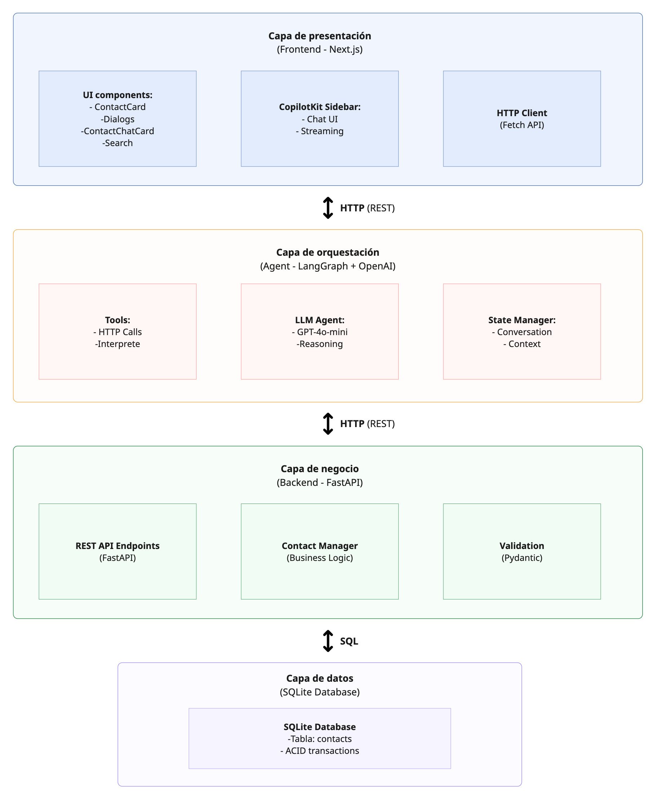

# Sistema de Gestión de Contactos

---

## 📑 Tabla de Contenidos

- [1. Descripción General](#1-descripción-general)
- [2. Arquitectura del Sistema](#2-arquitectura-del-sistema)
- [3. Estructura del Proyecto](#3-estructura-del-proyecto)
- [4. Instalación y Configuración](#4-instalación-y-configuración)
- [5. Ejecución en Entorno Local](#5-ejecución-en-entorno-local)
- [6. Testing](#6-testing)
- [7. Tecnologías Utilizadas](#7-tecnologías-utilizadas)
- [8. Scripts Disponibles](#8-scripts-disponibles)
- [9. Troubleshooting](#9-troubleshooting)

---

## 1. Sample gestor de contactos con copilotKit

Sistema de gestión de contactos desarrollado como proyecto de referencia,
que implementa una arquitectura cliente–servidor utilizando Python (FastAPI)
y Next.js.

La aplicación permite realizar operaciones CRUD sobre contactos, incorporando
validación robusta, búsqueda avanzada y persistencia local mediante SQLite,
siguiendo principios de separación de responsabilidades y programación
orientada a objetos.

Como extensión experimental, el proyecto integra un agente conversacional
inteligente orquestado con CopilotKit y LangGraph (GPT-4o-mini), que permite
interactuar con el sistema mediante lenguaje natural. El agente actúa
exclusivamente como orquestador y consume la API REST del backend, sin acceder
directamente a la lógica de negocio ni a la base de datos.

Este repositorio está pensado tanto como proyecto demostrativo para portafolio
como con fines educativos.

---

## 2. Arquitectura 




---

## 3. Estructura del Proyecto

```
contact-manager/                      # Raíz del proyecto
│
├── backend/                         # Backend FastAPI + Lógica de Negocio
│   ├── app/                         # Módulo principal de la aplicación
│   │   ├── __init__.py
│   │   ├── api.py                   # Definición de endpoints REST
│   │   └── main.py                  # Punto de entrada FastAPI
│   │
│   ├── core/                        # Lógica de negocio central
│   │   ├── __init__.py
│   │   ├── contact.py               # Modelos Pydantic (Contact, ContactCreate, ContactUpdate)
│   │   └── contact_manager.py       # ContactManager (CRUD + SQLite)
│   │
│   ├── db/                          # Base de datos
│   │   └── contacts.db              # SQLite database file
│   │
│   ├── tests/                       # Tests del backend
│   │   ├── __init__.py
│   │   ├── test_api.py             # Tests de integración (HTTP endpoints)
│   │   └── test_contact_manager.py # Tests unitarios (lógica)
│   │
│   ├── .venv/                       # Entorno virtual Python (generado)
│   ├── requirements.txt             # Dependencias Python
│   └── README.md                    # Documentación del backend
│
├── frontend/                       # Frontend Next.js + Agent
│   │
│   ├── agent/                      # Agente LangGraph
│   │   ├── .venv/                  # Entorno virtual del agente (generado)
│   │   ├── main.py                 # Lógica del agente (tools, workflow)
│   │   ├── pyproject.toml          # Configuración y dependencias del agente
│   │   └── .env                    # Variables de entorno (OPENAI_API_KEY)
│   │
│   ├── src/                       # Código fuente Next.js
│   │   ├── app/                   # App Router de Next.js
│   │   │   ├── api/
│   │   │   │   └── api.ts         # Cliente HTTP para backend
│   │   │   ├── globals.css        # Estilos globales
│   │   │   ├── layout.tsx         # Layout principal
│   │   │   └── page.tsx           # Página principal (CopilotKit)
│   │   │
│   │   ├── components/            # Componentes React
│   │   │   ├── contacts-card.tsx         # Componente principal de contactos
│   │   │   └── add-contact-dialog.tsx    # Diálogo crear/editar contacto
│   │   │   └── contact-chat-card.tsx     # Componente para desplegar contactos en el chat
│   │   │
│   │   └── lib/                   # Utilidades
│   │       └── types.ts           # Tipos TypeScript compartidos
│   │
│   ├── public/                    # Archivos estáticos
│   │
│   ├── .next/                     # Build output (generado)
│   ├── node_modules/              # Dependencias npm (generado)
│   ├── package.json               # Configuración npm
│   ├── next.config.ts             # Configuración Next.js
│   ├── tsconfig.json              # Configuración TypeScript
│   ├── tailwind.config.ts         # Configuración Tailwind CSS
│   ├── postcss.config.mjs         # Configuración PostCSS
│   └── README.md                  # Documentación del frontend
│
├── scripts/                        # Scripts de utilidad
│   └── install.sh                  # Script de instalacion rápida
│
├── node_modules/                     # Dependencias raíz (generado)
│
├── package.json                      # Scripts y deps del proyecto raíz
├── package-lock.json                 # Lock file npm (generado)
├── .gitignore                        # Archivos ignorados por Git
└── README.md                         # Documentación principal (este archivo)
```

---

## 4. Instalación y Configuración 🚀 (Quick start)

### 4.1 Clonar el Repositorio

```bash
git clone https://github.com/tu-usuario/contact-manager.git
cd contact-manager
```

### 4.2 Opción A: Instalación Automática (Recomendada)

**Script todo-en-uno**:

```bash
# Dar permisos de ejecución
chmod +x scripts/install.sh

# Ejecutar (instala todo)
./scripts/install.sh
```

**El script realiza**:
1. Instala dependencias raíz (`concurrently`)
2. Crea entorno virtual Python en `backend/.venv`
3. Instala dependencias del backend
4. Instala dependencias del frontend
5. Crea entorno virtual Python en `frontend/agent/.venv`
6. Instala dependencias del agent
7. Inicia backend, frontend y agent simultáneamente

### 4.3 Opción B: Instalación Manual

#### Paso 1: Dependencias Raíz

```bash
npm install
```

#### Paso 2: Backend

```bash
npm run install:backend
```

#### Paso 3: Frontend y Agent

```bash
npm run install:frontend
```

### 4.4 Configuración de Variables de Entorno

#### Agent

**Requerido** - necesita API key de OpenAI.

Crear archivo `frontend/agent/.env`:
```bash
# Opción 1: Desde la terminal
echo 'OPENAI_API_KEY=sk-tu-api-key-aqui' > frontend/agent/.env

# Opción 2: Crear manualmente
nano frontend/agent/.env
# Pegar: OPENAI_API_KEY=sk-tu-api-key-aqui
```
---

## 5. Ejecución en Entorno Local

### 5.1 Inicio Rápido (Todo en Uno)

```bash
# Desde la raíz del proyecto
npm run dev
```

**Esto inicia**:
- Backend FastAPI en http://localhost:8001
- Frontend Next.js en http://localhost:3000
- Agent LangGraph en http://localhost:8123 (interno)

```

### 5.2 Verificación de Servicios

#### 1. Backend (FastAPI)

**Abrir en navegador**: http://localhost:8001

**Respuesta esperada**:
```json
{
  "status": "ok",
  "service": "Contact Manager API",
  "version": "1.0.0",
  "docs": "/docs"
}
```

**Documentación interactiva**: http://localhost:8001/docs

#### 2. Frontend (Next.js)

**Abrir en navegador**: http://localhost:3000


#### 3. Agent (LangGraph)

**Verificación interna** - no tiene UI propia.

**Test desde chat**:
1. Abrir http://localhost:3000
2. Click en el chat (sidebar derecha)
3. Escribir: "Hola"
4. Debe responder: "👋 Hola! Soy tu asistente..."

---

## 6. Testing

### 6.1 Ejecutar Todos los Tests

```bash
# Desde la raíz del proyecto
npm run test:backend
```

---

### Tech Stack

- **Backend**: Python, FastAPI, SQLite  
- **Frontend**: Next.js, React, TypeScript, Tailwind CSS  
- **AI Agent**: CopilotKit, LangGraph, OpenAI API 

---

## 8. Scripts Disponibles

### 8.1 Scripts Raíz (`package.json`)

```bash
# Instalación
npm run install:all       # Instalar backend + frontend + agent
npm run install:backend   # Solo backend
npm run install:frontend  # Solo frontend (incluye agent)

# Desarrollo
npm run dev              # Ejecutar todo (backend + frontend)
npm run dev:backend      # Solo backend FastAPI
npm run dev:frontend     # Solo frontend Next.js + agent

# Testing
npm run test:backend     # Ejecutar tests del backend
```

---

## 9. Troubleshooting

### 9.1 Problemas Comunes

#### Error: "Module not found"

**Backend**:
```bash
# Reinstalar dependencias
rm -rf backend/.venv
npm run install:backend
```

**Frontend**:
```bash
# Reinstalar node_modules
cd frontend
rm -rf node_modules .next
npm install
```

#### Error: "Port already in use"

```bash
# Verificar qué proceso usa el puerto
lsof -i :8001  # Backend
lsof -i :3000  # Frontend

# Matar proceso
kill -9 <PID>
```

#### Error: "OPENAI_API_KEY not set"

```bash
# Verificar que existe
cat frontend/agent/.env

# Si no existe, crear
echo 'OPENAI_API_KEY=sk-tu-key' > frontend/agent/.env
```

## Acerca de mí

Hola, soy **Francisca Sapiains** 👋  
Conecta conmigo en [LinkedIn](https://www.linkedin.com/in/francisca-sapiains-186857181/) y revisa otros de mis proyectos en mi [portafolio](https://francisca-sapiains.vercel.app/)

